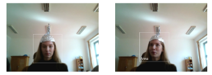

# Facial Recognition Project
Welcome to the Facial Recognition project! This README provides a brief overview of what the project does, the technologies it uses, and how to set it up and run.

## What It Does
This project implements facial recognition using OpenCV and a Haar Cascade classifier to detect faces in real-time from a webcam feed. It allows you to capture faces, save them for training, and recognize faces based on a pre-trained model.

## How It Works
### Core Components
Face Detection: Uses Haar Cascade classifiers to detect faces in the video feed.
Face Recognition: Recognizes faces using Local Binary Patterns Histograms (LBPH) with OpenCV's face recognition module.
Training: Captures face images, labels them, and trains a recognizer.
### Technologies and Libraries
Python: Main programming language.
NumPy: For numerical operations.
OpenCV: For real-time computer vision tasks.
Pickle: For serializing and deserializing Python objects.
PIL (Python Imaging Library): For image processing.
## Setup and Running
### Prerequisites
Make sure you have Python and the required libraries installed:

pip install numpy opencv-python opencv-contrib-python pillow
## Running the Project
### Clone the Repository:
git clone https://github.com/tichytomas/Facial-recogniton

### Set Up Directories:

Ensure you have the Haar Cascade file (haarcascade_frontalface_alt2.xml) in the correct directory.
Create a directory to store captured faces, e.g., facial_recognition/obliceje.
### Capture Faces:

Run the face capture script to capture and save faces.

Run the training script to train the recognizer with the captured faces.

Run the recognition script to start recognizing faces in the webcam feed.
